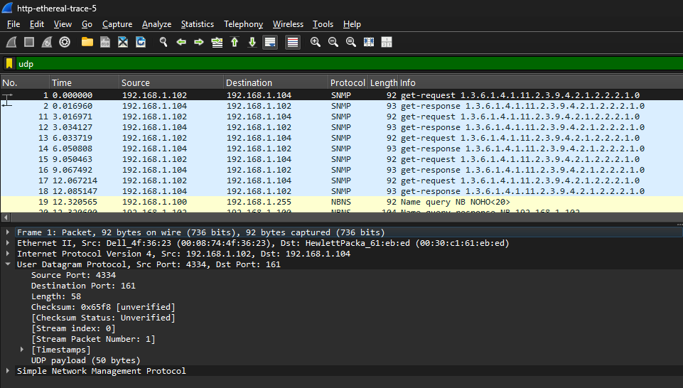
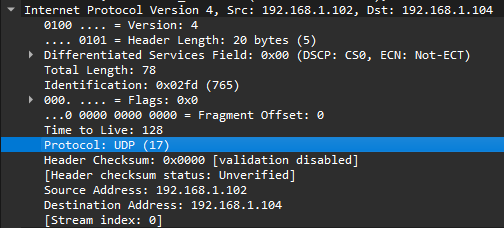
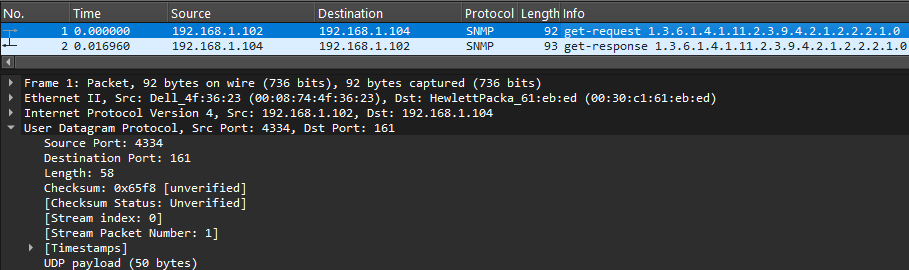
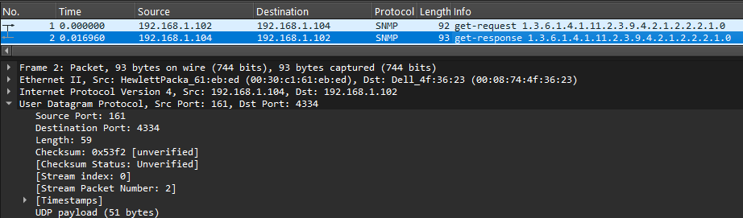

# Modul 4 DNS 

**Nama:** Gusti Rifan  
**NIM:** 103072400150  
**Kelas:** IF-04-05  
**Mata Kuliah:** Jaringan Komputer

---

## 
Tujuan Praktikum 
1. Mahasiswa dapat menginvestigasi cara kerja protokol UDP menggunakan Wireshark

---

### UDP
UDP (User Datagram Protocol) adalah salah satu protokol pada layer transport dalam model TCP/IP yang digunakan untuk mengirimkan data tanpa koneksi (connectionless). Artinya, UDP tidak melakukan proses pembentukan koneksi terlebih dahulu sebelum mengirim data.

- Download file http://gaia.cs.umass.edu/wireshark-labs/wireshark-traces.zip
- Extract file dan cari file http-ethereal-trace-5
- Klik kanan file tersebut, lalu buka (open with) dengan wireshark

- Lakukan filter UDP dan pilih 1 paket UDP

### pertanyaan

Selanjutnya, jawablah beberapa pertanyaan berikut.
1. Pilih satu paket UDP yang terdapat pada trace Anda. Dari paket tersebut, berapa banyak
“field” yang terdapat pada header UDP? Sebutkan nama-nama field yang Anda temukan!

-> Field UDP

Terdapat 4 field : Source Port, Destination Port, Length, Checksum

2. Perhatikan informasi “content field” pada paket yang Anda pilih di pertanyaan 1. Berapa
panjang (dalam satuan byte) masing-masing “field” yang terdapat pada header UDP?

-> Panjang tiap field Bedasarkan teori UDP :
   - Source Port = 2 byte
   - Destination Port = 2 byte
   - Length = 2 byte
   - Checksum = 2 byte Maka total = 2+2+2+2 = 8 byte

3. Nilai yang tertera pada ”Length” menyatakan nilai apa? Verfikasi jawaban Anda melalui
paket UDP pada trace.

-> Length

Length (58) menunjukkan total panjang UDP (header (8 byte) + data). 
maka Data = total - header = 58 - 8 = 50 byte, 
hal tersebut cocok dengan UDP payload (50 byte).

4. Berapa jumlah maksimum byte yang dapat disertakan dalam payload UDP?

-> Jumlah maksimum byte UDP :
   - Header UDP = 8 byte
   - Max ukuran IP = 65535 byte
   - 65535 - 20 (IP header) - 8 (UDP header) = 65507 byte. Maka maksimum payload UDP adalah 65507 byte

5. Berapa nomor port terbesar yang dapat menjadi port sumber?

-> Port terbesar Nomor port terbesar yang dapat digunakan adalah 65535. Hal ini karena field port pada UDP memiliki ukuran 16 bit, sehingga nilai maksimumnya adalah 2^16 - 1 yaitu 65535.

6. Berapa nomor protokol untuk UDP? Berikan jawaban Anda dalam notasi heksadesimal dan
desimal. Untuk menjawab pertanyaan ini, Anda harus melihat ke bagian ”Protocol” pada
datagram IP yang mengandung segmen UDP.

-> Nomor protokol UDP

Nomor protokol UDP adalah 17 (desimal) atau 0x11 (heksadesimal)

7. Periksa pasangan paket UDP di mana host Anda mengirimkan paket UDP pertama dan paket
UDP kedua merupakan balasan dari paket UDP yang pertama.

-> Hubungan port

- REQUEST -> Source Port : 4334 & Destination Port : 161
- RESPONSE -> Source Port : 161 & Destination Port : 4334
- Nomor port pada paket balasan merupakan kebalikan dari paket permintaan, di mana port sumber dan tujuan saling bertukar