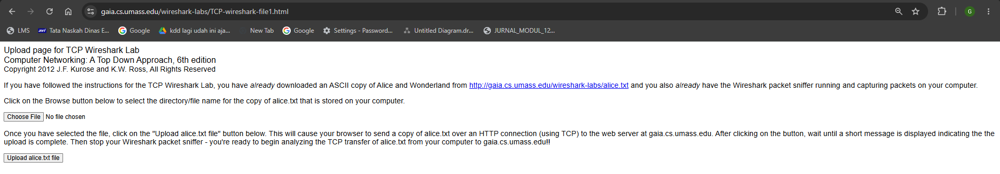
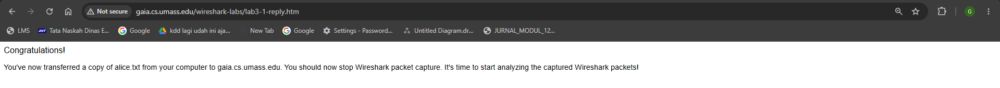
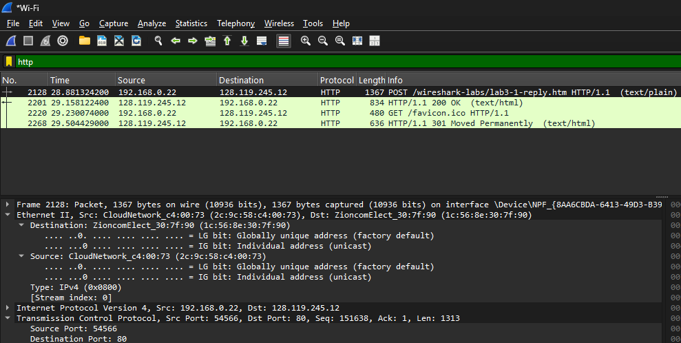
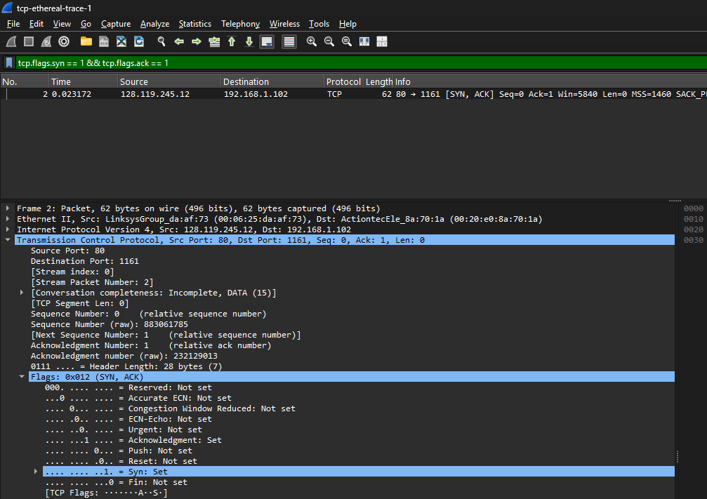
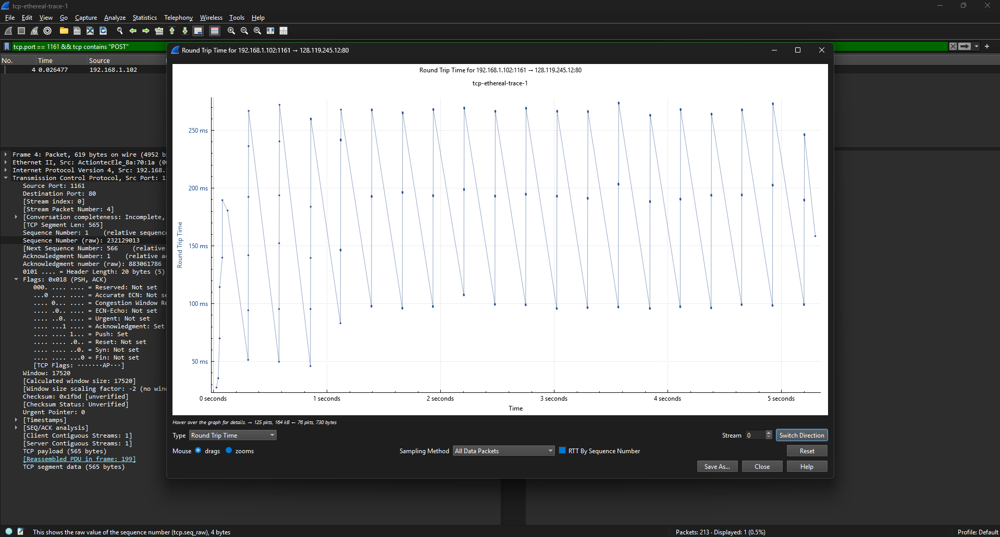
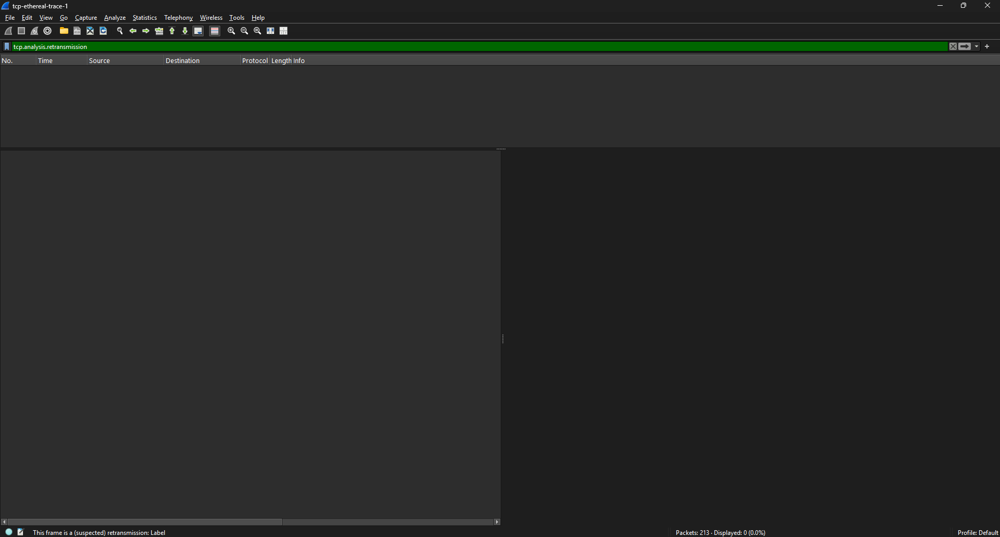
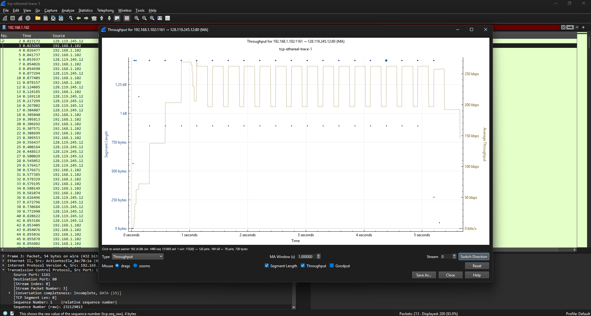

# Laporan Praktikum Modul 6 TCP

**Nama:** Gusti Rifan  
**NIM:** 103072400150  
**Kelas:** IF-04-05  
**Mata Kuliah:** Jaringan Komputer

---

## 
Tujuan Praktikum 
1. Mahasiswa dapat menginvestigasi cara kerja protokol TCP menggunakan Wireshark

---

### Analisis Transfer File Menggunakan Protokol TCP

- Download file http://gaia.cs.umass.edu/wireshark-labs/alice.txt

- Buka browser http://gaia.cs.umass.edu/wireshark-labs/TCP-wireshark-file1.html dan pilih file alice.txt

- Buka wireshark, pilih wifi, aktifkan (start)

- Kembali ke browser klik Upload alice.txt hingga muncul tampilan “Congratulations”

- Hentikan penangkapan paket pada Wireshark. Lakukan filter "tcp" maka Jendela Wireshark Anda akan terlihat
seperti gambar di bawah.

Paket SYN digunakan untuk memulai koneksi TCP antara client dan server (proses three-way handshake), 
bukan untuk mengirim file. Proses ini memastikan bahwa koneksi siap digunakan sebelum data ditransfer. 
Setelah koneksi berhasil dibuat, data file akan dikirim dalam beberapa segmen kecil melalui TCP. 
Hal ini terjadi karena TCP membagi data menjadi bagian-bagian kecil agar pengiriman lebih efisien dan dapat dikontrol.

Selanjutnya, setelah proses upload selesai, server mengirimkan respon HTTP/1.1 200 OK. 
Pesan ini menandakan bahwa file telah berhasil diterima dan diproses oleh server. 
Setelah itu, halaman web menampilkan pesan “Congratulations” sebagai indikasi bahwa proses upload berhasil.

### Pertanyaan

1. Berapa alamat IP dan nomor port TCP yang digunakan oleh komputer klien (sumber) untuk
mentransfer file ke gaia.cs.umass.edu?

IP server : 192.168.0.22 
Port server : 54566

2. Apa alamat IP dari gaia.cs.umass.edu? Pada nomor port berapa ia mengirim dan menerima
segmen TCP untuk koneksi ini?

IP server : 128.119.245.12 
Port server : 80

### Dasar TCP

- Download dan extrak file http://gaia.cs.umass.edu/wireshark-labs/wireshark-traces.zip

- Buka file dan pilih paket paket tcp-ethereal-trace-1, buka dengan wireshark

### Pertanyaan

1. Nomor urut SYN, mencari data di filter tcp.flags.syn == 1 && tcp.flags.ack == 0

Nomor urut pada segmen TCP SYN adalah 0. Segmen ini teridentifikasi sebagai SYN karena memiliki flag SYN pada bagian TCP Flags.

2. SYN-ACK, mencari data di filter tcp.flags.syn == 1 && tcp.flags.ack == 1

Nomor urut (sequence number) pada segmen SYN-ACK adalah 0, 
sedangkan nilai acknowledgment adalah 1. Nilai acknowledgment diperoleh dari sequence number pada segmen SYN sebelumnya yang ditambah 1.
Segmen ini dapat diidentifikasi sebagai SYN-ACK karena memiliki flag SYN dan ACK pada bagian TCP Flags

3. Sequence number POST, mencari data di filter tcp.port == 1161 && tcp contains "POST"

Nomor urut segmen TCP yang berisi perintah HTTP POST adalah 1

4. 6 segmen pertama + RTT 

Nilai RTT diperoleh dari selisih waktu antara pengiriman segmen TCP dan penerimaan acknowledgment. 
Berdasarkan grafik Round Trip Time, nilai RTT berkisar antara sekitar 100 ms hingga 300 ms. 
Nilai RTT ini bervariasi karena dipengaruhi oleh kondisi jaringan selama proses transfer

5. Panjang 6 segmen

Panjang 6 segmen adalah 7.865 byte

6. Buffer receiver

Nilai minimum ruang buffer yang tersedia pada penerima adalah 5840 byte, 
yang terlihat dari nilai window size pada segmen TCP

7. Retransmission

Tidak ditemukan retransmission. Hal ini dapat dilihat dari tidak adanya / adanya label “TCP Retransmission” pada Wireshark.

8. ACK behavior

Jumlah data yang di-ACK tidak tetap dan bisa banyak. Penerima dapat mengakui beberapa segmen sekaligus, tidak selalu satu per satu

9. Thoroughtput

Throughput adalah jumlah data yang ditransfer per satuan waktu. Berdasarkan grafik throughput, kecepatan transfer meningkat secara bertahap hingga mencapai sekitar 200 kbps hingga 270 kbps. Nilai ini menunjukkan performa koneksi TCP selama proses pengiriman data

### Congestion Control pada TCP

Peertanyaan 

1. Identifikasi Slow Start & Congestion Avoidance (file tcp-ethereal-trace-1)

Fase slow start terjadi pada awal koneksi (0 – ±1 detik) dengan pertumbuhan eksponensial. Fase ini berakhir ketika mencapai threshold, 
ditandai perubahan grafik menjadi linear. Selanjutnya TCP masuk ke fase congestion avoidance dengan pertumbuhan linear.
Data nyata menunjukkan sedikit deviasi dari teori karena kondisi jaringan seperti delay dan variasi ACK.
Koneksi TCP pada grafik dapat dikatakan relatif stabil karena tidak menunjukkan penurunan drastis pada sequence number yang mengindikasikan packet loss besar atau timeout.
Namun, grafik tidak sepenuhnya halus seperti pada model TCP ideal.

2. Identifikasi Slow Start & Congestion Avoidance (alice.txt)

- Uploud file alice.txt ke http://gaia.cs.umass.edu/wireshark-labs/TCP-wireshark-file1.html
- filter "TCP"
- Klik Statistics -> TCP Stream Graph -> Time-Sequence Graph (Stevens)

.png)

Pada grafik kedua, fase slow start terjadi pada awal koneksi dengan pertumbuhan eksponensial yang sangat cepat. 
Transisi ke congestion avoidance terjadi lebih cepat dibandingkan grafik sebelumnya. 
Hal ini menunjukkan bahwa koneksi Wi-Fi memiliki respon yang lebih cepat, namun juga lebih rentan terhadap variasi delay.
Secara umum, koneksi tetap stabil, meskipun tidak sepenuhnya mengikuti perilaku ideal TCP akibat kondisi jaringan nirkabel.