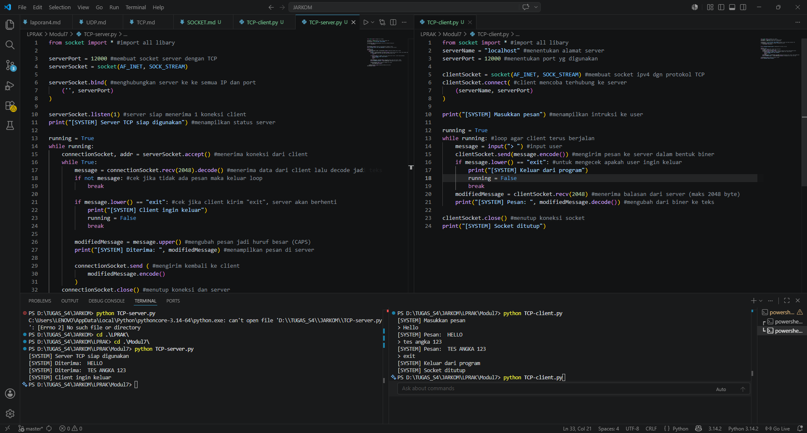
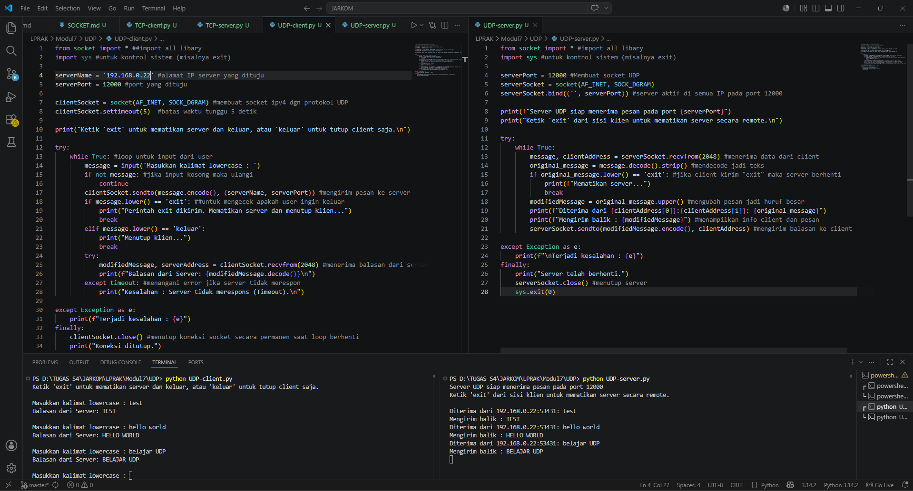

# Modul 7 SOCKET PROGRAMMING: MEMBUAT APLIKASI JARINGAN  

**Nama:** Gusti Rifan  
**NIM:** 103072400150  
**Kelas:** IF-04-05  
**Mata Kuliah:** Jaringan Komputer

---

##
Tujuan Praktikum 
1.	Mahasiswa bisa membuat program berbasis socket UDP 
2.	Mahasiswa bisa membuat program berbasis socket TCP 

---

### Program Socket 

Socket Programming adalah teknik dalam pemrograman yang digunakan untuk membangun komunikasi antar perangkat melalui jaringan (network),
baik dalam jaringan lokal maupun internet. Socket memungkinkan data dikirim dan diterima menggunakan protokol jaringan seperti:

- TCP (Transmission Control Protocol) : koneksi stabil, data pasti sampai
- UDP (User Datagram Protocol) : lebih cepat, tapi tidak menjamin data sampai Konsep Dasar Socket

1. Server
- Menunggu koneksi dari client
- Menerima dan memproses data

2. Client
Menghubungi server
Mengirim dan menerima data

### TCP

### TCP-Client

from socket import * #import all libary
serverName = "localhost" #menentukan alamat server
serverPort = 12000 #menentukan port yg digunakan

clientSocket = socket(AF_INET, SOCK_STREAM) #membuat socket ipv4 dgn protokol TCP
clientSocket.connect( #client mencoba terhubung ke server
    (serverName, serverPort)
)

print("[SYSTEM] Masukkan pesan") #menampilkan intruksi ke user

running = True
while running: #loop agar client terus berjalan
    message = input("> ") #input user
    clientSocket.send(message.encode()) #mengirim pesan ke server dalam bentuk biner
    if message.lower() == "exit": #untuk mengecek apakah user ingin keluar
        print("[SYSTEM] Keluar dari program")
        running = False
        break
    modifiedMessage = clientSocket.recv(2048) #menerima balasan dari server (maks 2048 byte)
    print("[SYSTEM] Pesan: ", modifiedMessage.decode()) #mengubah dari biner ke teks

clientSocket.close() #menutup koneksi socket
print("[SYSTEM] Socket ditutup")

### TCP-Server

from socket import * #import all libary

serverPort = 12000 #membuat socket server dengan TCP
serverSocket = socket(AF_INET, SOCK_STREAM)

serverSocket.bind( #menghubungkan server ke ke semua IP dan port
    ('', serverPort)
) 

serverSocket.listen(1) #server siap menerima 1 koneksi client
print("[SYSTEM] Server TCP siap digunakan") #menampilkan status server

running = True
while running:
    connectionSocket, addr = serverSocket.accept() #menerima koneksi dari client
    while True:
        message = connectionSocket.recv(2048).decode() #menerima data dari client lalu decode jadi teks
        if not message: #cek jika tidak ada pesan maka keluar loop
            break

        if message.lower() == "exit": #cek jika client kirim "exit", server akan berhenti
            print("[SYSTEM] Client ingin keluar")
            running = False
            break

        modifiedMessage = message.upper() #mengubah pesan jadi huruf besar (CAPS)
        print("[SYSTEM] Diterima: ", modifiedMessage) #menampilkan pesan di server

        connectionSocket.send ( #mengirim kembali ke client
            modifiedMessage.encode()
        )
    connectionSocket.close() #menutup koneksi dan server
serverSocket.close()

### Output program :

Program ini bekerja dengan konsep:

- Server dijalankan terlebih dahulu.
- Client terhubung ke server.
- Client mengirim pesan.
- Server mengubah pesan menjadi huruf besar (uppercase).
- Server mengirim balik hasilnya ke client.
- Jika kirim "exit" maka koneksi ditutup.

### UDP

### UDP-Client

from socket import * ##import all libary
import sys #untuk kontrol sistem (misalnya exit)

serverName = '192.168.0.22' #alamat IP server yang dituju
serverPort = 12000 #port yang dituju

clientSocket = socket(AF_INET, SOCK_DGRAM) #membuat socket ipv4 dgn protokol UDP
clientSocket.settimeout(5)  #batas waktu tunggu 5 detik

print("Ketik 'exit' untuk mematikan server dan keluar, atau 'keluar' untuk tutup client saja.\n")

try:
    while True: #loop untuk input dari user
        message = input('Masukkan kalimat lowercase : ')
        if not message: #jika input kosong maka ulangi
            continue
        clientSocket.sendto(message.encode(), (serverName, serverPort)) #mengirim pesan ke server
        if message.lower() == 'exit': ##untuk mengecek apakah user ingin keluar
            print("Perintah exit dikirim. Mematikan server dan menutup klien...")
            break
        elif message.lower() == 'keluar':
            print("Menutup klien...")
            break
        try:
            modifiedMessage, serverAddress = clientSocket.recvfrom(2048) #menerima balasan dari server
            print(f"Balasan dari Server: {modifiedMessage.decode()}\n")
        except timeout: #menangani error jika server tidak merespon
            print("Kesalahan : Server tidak merespons (Timeout).\n")

except Exception as e:
    print(f"Terjadi kesalahan : {e}")
finally:
    clientSocket.close() #menutup koneksi socket secara permanen saat loop berhenti
    print("Koneksi ditutup.")

### UDP-Server

from socket import * #import all libary
import sys #untuk kontrol sistem (misalnya exit)

serverPort = 12000 #Membuat socket UDP
serverSocket = socket(AF_INET, SOCK_DGRAM)
serverSocket.bind(('', serverPort)) #server aktif di semua IP pada port 12000

print(f"Server UDP siap menerima pesan pada port {serverPort}")
print("Ketik 'exit' dari sisi klien untuk mematikan server secara remote.\n")

try:
    while True:
        message, clientAddress = serverSocket.recvfrom(2048) #menerima data dari client
        original_message = message.decode().strip() #mendecode jadi teks
        if original_message.lower() == 'exit': #jika client kirim "exit" maka server berhenti
            print(f"Mematikan server...")
            break
        modifiedMessage = original_message.upper() #mengubah pesan jadi huruf besar
        print(f"Diterima dari {clientAddress[0]}:{clientAddress[1]}: {original_message}")
        print(f"Mengirim balik : {modifiedMessage}") #menampilkan info client dan pesan
        serverSocket.sendto(modifiedMessage.encode(), clientAddress) #mengirim balasan ke client
        
except Exception as e:
    print(f"\nTerjadi kesalahan : {e}")
finally:
    print("Server telah berhenti.")
    serverSocket.close() #menutup server
    sys.exit(0)

### Output program :

Program ini bekerja dengan konsep:

- Server dijalankan terlebih dahulu.
- Client terhubung ke server.
- Client mengirim pesan.
- Server mengubah pesan menjadi huruf besar (uppercase).
- Server mengirim balik hasilnya ke client.
- Jika kirim "exit" maka koneksi ditutup.

### Perbedaan TCP dan UDP

- TCP: lebih aman dan andal, tetapi lebih berat.
- UDP: lebih cepat dan ringan, tetapi tidak menjamin pengiriman.

### Analogi Kehidupan Sehari-Hari
TCP = Kurir dengan tanda tangan penerima.
UDP = Lempar selebaran ke kotak surat.

### Kesimpulan

Jika aplikasi membutuhkan keakuratan dan keandalan, gunakan TCP. Jika aplikasi membutuhkan latensi rendah dan toleran terhadap kehilangan data, gunakan UDP.
