# Modul 3 - HTTP

**Nama:** Gusti Rifan  
**NIM:** 103072400150  
**Kelas:** IF-04-05  
**Mata Kuliah:** Jaringan Komputer

---

## 
Tujuan Praktikum 
1. Mahasiswa dapat menginvestigasi cara kerja protokol HTTP menggunakan Wireshark. 
---

### Basic HTTP GET / Response Interaction
1. Membuka wireshark dan memilih interface jaringan WiFi.
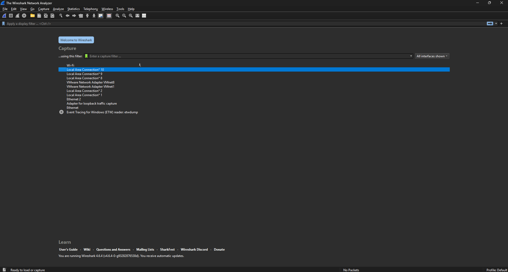

2. Membuka browser lalu masuk ke link berikut, http://gaia.cs.umass.edu/wireshark-labs/HTTP-wireshark-file1.html.
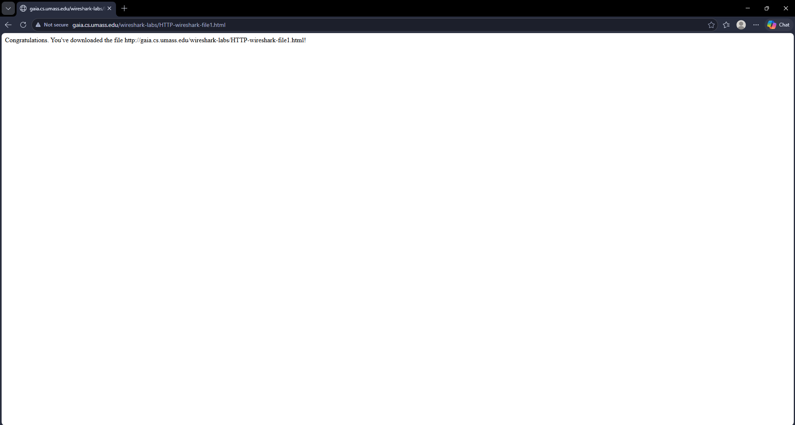

3. Buka wireshark kembali dan ketik http pada pencarian, maka akan muncul 2 paket HTTP utama(GET dan response).
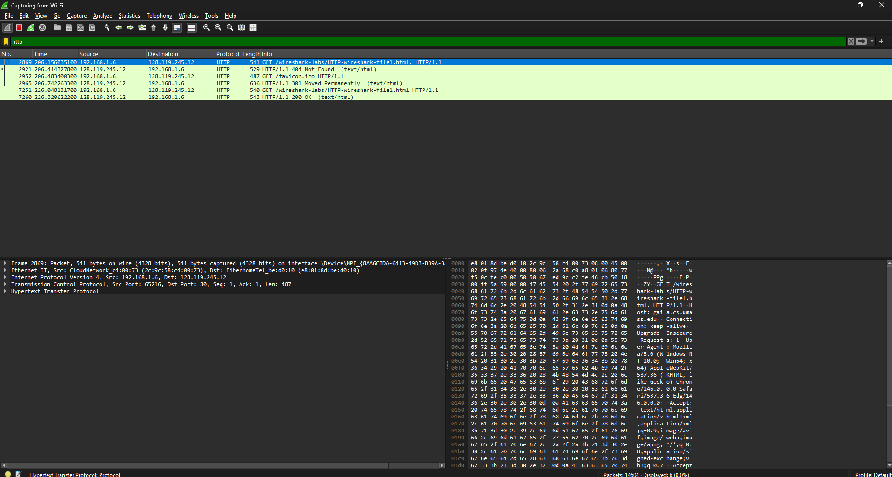

4. Perhatikan baris length info berteks 200 ok (text/html), lalu dapat dilihat hypertext dan Line-based text data.
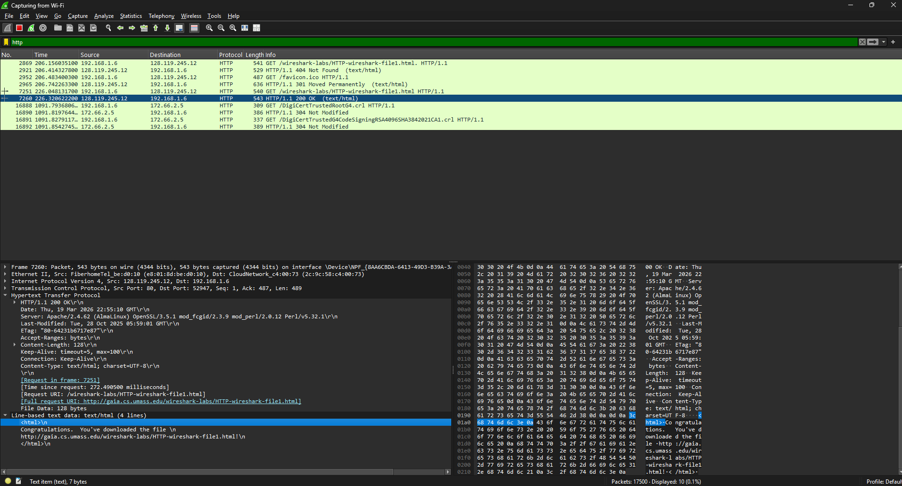

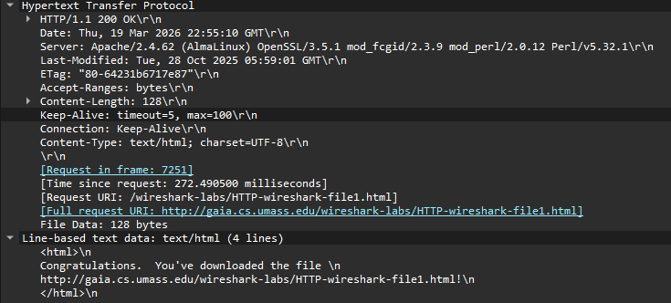

### HTTP Conditional GET
5. Buka kembali browser dan masuk ke link berikut, http://gaia.cs.umass.edu/wireshark-labs/HTTP-wireshark-file2.html.
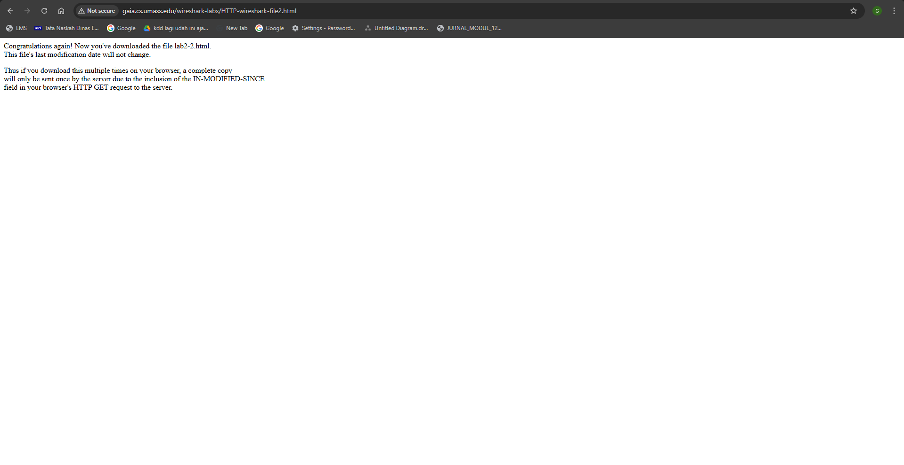

6. Buka kembali wireshark dan ketik http pada pencarian. Perhatikan baris length info 200 ok (text/html),
   lalu lihat hypertext dan Line-based text datanya.
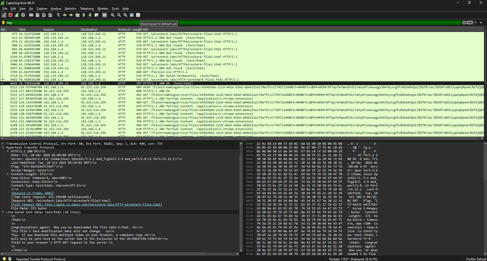

### Retrieving Long Documents
7. Kembali ke browser dan buka link berikut, http://gaia.cs.umass.edu/wireshark-labs/HTTP-wireshark-file3.html.
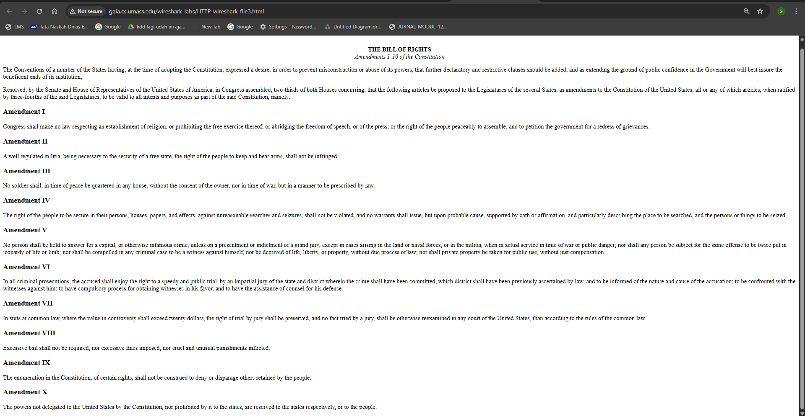

8. Buka kembali wireshark dan ketik http pada pencarian. Perhatikan baris length info 200 ok (text/html),
   lalu lihat hypertext dan Line-based text datanya.

### HTML dengan Embedded Objects
9. Kembali ke browser dan buka link berikut, http://gaia.cs.umass.edu/wireshark-labs/HTTP-wireshark-file3.html.
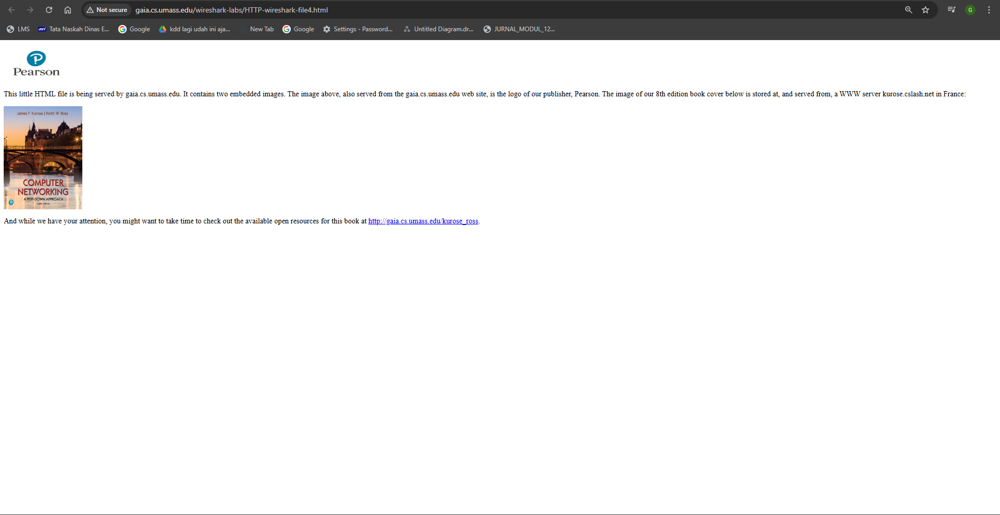

10. Buka kembali wireshark dan ketik http pada pencarian. Perhatikan baris length info 200 ok (text/html),
   lalu lihat hypertext dan Line-based text datanya.

### HTTP Authentication 
11. Kembali ke browser dan buka link berikut, http://gaia.cs.umass.edu/wiresharklabs/protected_pages/HTTP-wireshark-file5.html 
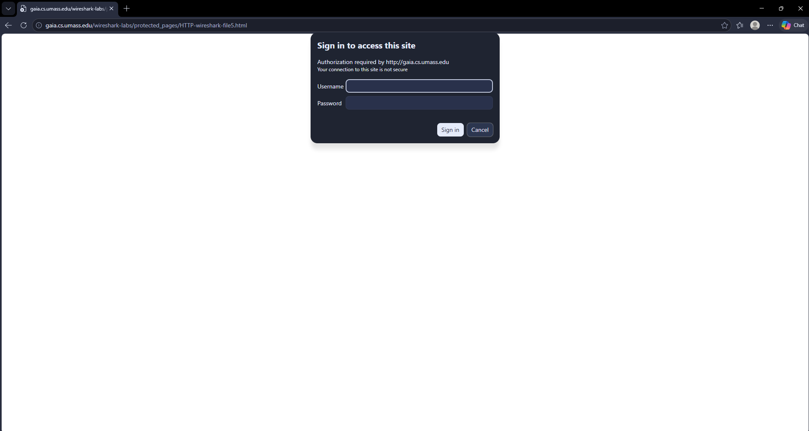

12. Masukkan login dengan Username (wireshark-students) dan password (network).

13. Login berhasil

14. Buka kembali wireshark dan ketik http pada pencarian. Perhatikan baris length info 200 ok (text/html),
   lalu lihat hypertext dan Line-based text datanya.

15. Jika semua sudah selesai kita dapat menekan tombol close maka wireshark akan stop capture dan kita akan menutup wireshark.
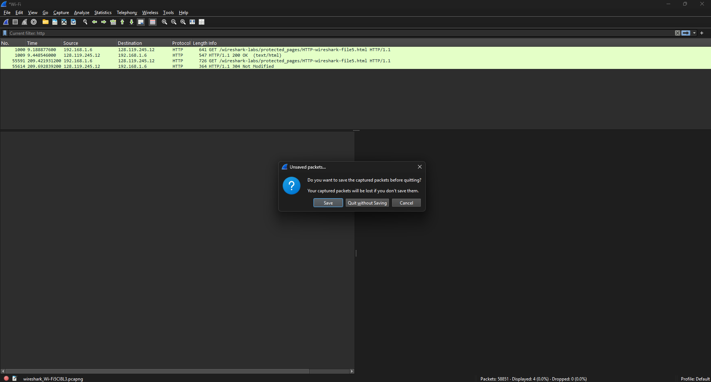
