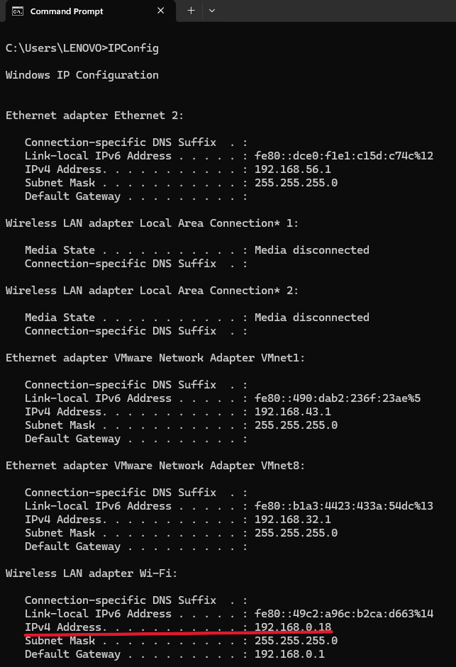
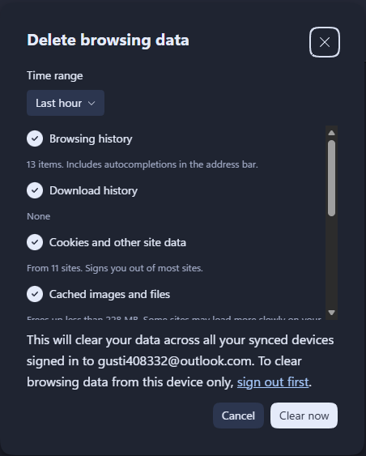
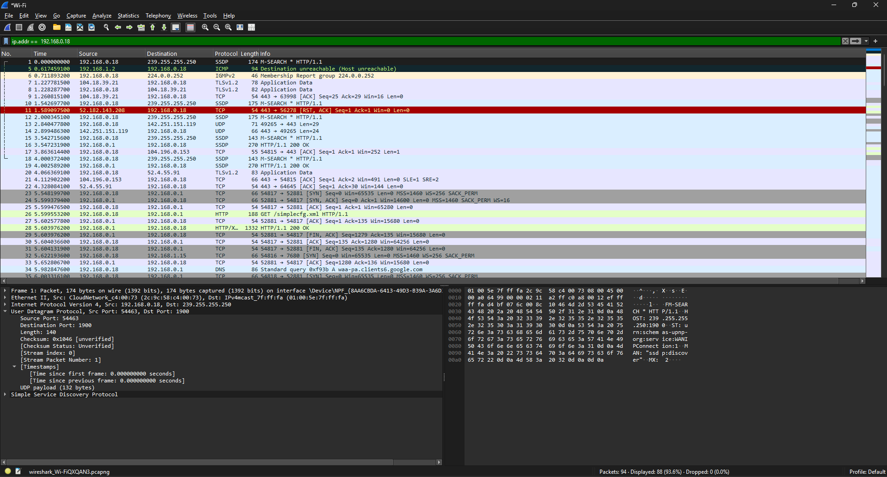
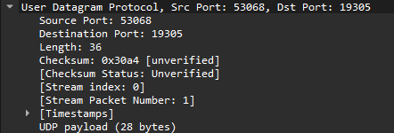

# Modul Modul 4 DNS 

**Nama:** Gusti Rifan  
**NIM:** 103072400150  
**Kelas:** IF-04-05  
**Mata Kuliah:** Jaringan Komputer

---

## 
Tujuan Praktikum 
1. Mahasiswa dapat menginvestigasi cara kerja DNS menggunakan Wireshark 

---

### Nslookup 
Untuk menjalankannya di Windows, buka Comand promt dan ketik nslookup pada baris perintah.
Jalankan beberapa perintah berikut :

- nslookup www.mit.edu untuk menampilkan IP address dari website tersebut

 
- nslookup -type=NS mit.edu untuk menemukan Name Servers (NS) resmi yang bertanggung jawab untuk domain mit.edu. 
tanpa *-tpe=NS, maka yang tampil hanyalah informasi default.

- nslookup www.aiit.or.kr bitsy.mit.edu digunakan untuk mencari alamat IP dari host www.aiit.or.kr dengan menggunakan server DNS bitsy.mit.edu secara langsung, 
bukan melalui server DNS lokal.

Sekarang setelah kita mempelajari gambaran umum tentang nslookup, sekarang saatnya bagi Anda untuk melakukan pengujian mandiri. Lakukan beberapa hal berikut (dan amati hasilnya): 
1.	Jalankan nslookup untuk mendapatkan alamat IP dari server web di Asia. Berapa alamat IP server tersebut? 

nslookup www.ntu.edu.sg
Name:    www.ntu.edu.sg
Address: 104.16.4.14

2.	Jalankan nslookup agar dapat mengetahui server DNS otoritatif untuk universitas di Eropa. 

nslookup -type=NS ox.ac.uk
DNS server : dns0.ox.ac.uk, dns1.ox.ac.uk, dns2.ox.ac.uk, auth4.dns.ox.ac.uk, auth5.dns.ox.ac.uk, auth6.dns.ox.ac.uk

3.	Jalankan nslookup untuk mencari tahu informasi mengenai server email dari Yahoo! Mail melalui salah satu server yang didapatkan di pertanyaan nomor 2. Apa alamat IP-nya? 

nslookup -type=MX yahoo.com ns1.ox.ac.uk
MX preference = 1, mail exchanger = mta5.am0.yahoodns.net
Nama mail server & IP address

### Ipconfig 

Ipconfig dapat digunakan untuk menampilkan informasi mengenai TCP/IP Anda saat ini, termasuk alamat IP Anda, alamat server DNS, jenis adaptor, dan sebagainya.

- Sebagai contoh, anda dapat memperoleh semua informasi tentang host Anda hanya dengan memasukkan: 
ipconfig /all ke dalam Command Prompt.

Kita dapat melihat informasi jaringan seperti IP address, subnet mask, defaul gateway, DNS server, MAC address.

- Perintah ipconfig /displaydns, Berfungsi untuk menampikan daftar domain yang pernah diakses

- Perintah ipconfig /flushdns. Berfungsi untuk membersihkan cache DNS resolver.

### Tracing DNS dengan Wireshark 

- langkah pertama akan menggunakan IPConfig untuk mengosongkan catatan DNS di host Anda dan menyalin IP Address.

IP Address : 192.168.0.18

- Buka browser dan kosongkan cache-nya. (Pada Internet Explorer, buka menu Tools dan pilih Internet Options; lalu pada tab General pilih Delete Files).

- Buka Wireshark dan masukkan "ip.addr == 192.168.0.18" ke dalam filter. Bagian 192.168.0.18 diisi dengan alamat IP Anda yang didapatkan melalui ipconfig. 
Filter ini akan menghapus semua paket yang tidak berasal atau ditujukan ke host Anda.

- Dengan browser Anda, kunjungi halaman web: http://www.ietf.org

### Jawab beberapa pertanyaan berikut: 
1.	Cari pesan permintaan DNS dan balasannya. Apakah pesan tersebut dikirimkan melalui UDP atau TCP? 

- DNS menggunakan UDP

2.	Apa port tujuan pada pesan permintaan DNS? Apa port sumber pada pesan balasannya?

- Untuk port tujuan yang diberikan adalah 19305 dengan sumber port yang diberikan yaitu 53068.

3.	Pada pesan permintaan DNS, apa alamat IP tujuannya? Apa alamat IP server DNS lokal anda (gunakan ipconfig untuk mencari tahu)? Apakah kedua alamat IP tersebut sama?

- Alamat IP tujuan pada pesan DNS adalah alamat IP dari DNS server lokal. Berdasarkan hasil pengamatan menggunakan nslookup www.mit.edu , 
alamat tersebut sama dengan DNS server yang digunakan oleh host.

4.	Periksa pesan permintaan DNS. Apa “jenis” atau ”type” dari pesan tersebut? Apakah pesan permintaan tersebut mengandung ”jawaban” atau ”answers”? 

- Standard query A www.ietf.org, Answers: 0, maka tidak ada jawaban

5.	Periksa pesan balasan DNS. Berapa banyak ”jawaban” atau ”answers” yang terdapat di dalamnya? Apa saja isi yang terkandung dalam setiap jawaban tersebut? 

- DNS bisa memberi lebih dari 1 IP (load balancing), terdapat 3 jawaban 

6.	Perhatikan paket TCP SYN yang selanjutnya dikirimkan oleh host Anda. Apakah alamat IP pada paket tersebut sesuai dengan alamat IP yang tertera pada pesan balasan DNS? 

- alamat IP sesuai, dapat dilihat dari IP tujuan SYN dengan IP dari DNS response sudah sama

7.	Halaman web yang sebelumnya anda akses (http://www.ietf.org) memuat beberapa gambar. Apakah host Anda perlu mengirimkan pesan permintaan DNS baru setiap kali ingin mengakses suatu gambar? 

- Tidak selalu karena Jika domain sama maka tidak perlu DNS lagi (pakai cache) dan Jika domain berbeda maka perlu DNS baru

### nslookup www.mit.edu

1.	Apa port tujuan pada pesan permintaan DNS? Apa port sumber pada pesan balasan DNS? 
- DNS REQUEST -> Destination Port : 53

- DNS RESPONSE -> Source Port : 53

2.	Ke alamat IP manakah pesan permintaan DNS dikirimkan? Apakah alamat IP tersebut merupakan default alamat IP server DNS lokal Anda?

- IP tujuan = DNS server lokal
- Ya, sama dengan hasil ipconfig /all

 

3.	Periksa pesan permintaan DNS. Apa ”jenis” atau ”type” dari pesan tersebut? Apakah pesan tersebut mengandung ”jawaban” atau ”answers”? 

- Type: A, Tidak ada answer

4.	Periksa pesan balasan DNS. Berapa banyak ”jawaban” atau “answers” yang terdapat di dalamnya. Apa saja isi yang terkandung dalam setiap jawaban tersebut? 

-  DNS bisa memberi lebih dari 1 IP (load balancing), terdapat 3 jawaban 

### nslookup -type=NS mit.edu

1.	Ke alamat IP manakah pesan permintaan DNS dikirimkan? Apakah alamat IP tersebut merupakan default alamat IP server DNS lokal Anda? 

- Ke DNS lokal, sama dengan ipconfig

2.	Periksa pesan permintaan DNS. Apa ”jenis” atau ”type” dari pesan tersebut? Apakah pesan tersebut mengandung ”jawaban” atau ”answers”? 

- Type: NS, Tidak ada answer di request

3.	Periksa pesan balasan DNS. Apa nama server MIT yang diberikan oleh pesan balasan? Apakah pesan balasan ini juga memberikan alamat IP untuk server MIT tersebut? 

- Berisi server MIT dan memberikan IP address

### nslookup www.aiit.or.kr bitsy.mit.edu

1.	Ke alamat IP manakah pesan permintaan DNS dikirimkan? Apakah alamat IP tersebut merupakan default alamat IP server DNS lokal Anda? 

- Pesan dikirim ke server bitsy.mit.edu, bukan ke DNS lokal.

2.	Periksa pesan permintaan DNS. Apa ”jenis” atau ”type” dari pesan tersebut? Apakah pesan tersebut mengandung ”jawaban” atau ”answers”? 

- Jenis pesan adalah A dan tidak mengandung jawaban.

3.	Periksa pesan balasan DNS. Berapa banyak ”jawaban” atau “answers” yang terdapat di dalamnya. Apa saja isi yang terkandung dalam setiap jawaban tersebut? 

-  permintaan DNS mengalami timeout, sehingga server bitsy.mit.edu tidak memberikan respon terhadap query yang dikirimkan

---

Berdasarkan praktikum yang telah dilakukan, dapat disimpulkan bahwa Domain Name System (DNS) berfungsi untuk menerjemahkan nama domain menjadi alamat IP. Proses ini dilakukan melalui komunikasi antara client dan server DNS menggunakan protokol UDP pada port 53.

Dengan menggunakan Wireshark, dapat diamati proses DNS query dan response, serta hubungan antara DNS dan komunikasi TCP selanjutnya. Selain itu, penggunaan cache DNS memungkinkan proses akses menjadi lebih cepat karena tidak perlu melakukan query ulang untuk domain yang sama.